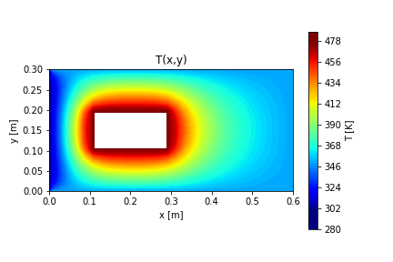

# General Code for Obtaining Temperature Distribution in Heat Conduction Problems for Simple Geometries
Author: André Henriques  

## Overview

This script provides a general framework for solving 2D heat conduction problems using a finite difference method (FDM) for simple geometries. It uses a mesh generated from an Excel sheet (`Malha.xlsx`) to set up the problem, calculate the temperature distribution, and visualize the results.

## Instructions

1. This is a general code but must be used alongside the spreadsheet file `Malha.xlsx` (which must be in the same directory as this script).  
2. Ensure that the mesh creation guidelines are followed as described in `Malha.xlsx`.  
3. Before running the simulation, select the appropriate sheet in the Excel file (refer to the sheet name in the script, typically `'Malha_0'` for the complete geometry).  
4. In the results plotting section, ensure that the appropriate line is selected and comment out the others. You can add additional lines for different meshes by modifying the minimum and maximum temperatures.  
5. The output will also provide additional information about the matrices and elements used in the simulation.

## Example output

## Notes
1. The code assumes a steady-state heat conduction problem with no internal heat generation unless otherwise specified.
2. The solution is obtained by solving a system of linear equations using the finite difference method (FDM) for a 2D plate.
3. The script includes provisions for dealing with various boundary conditions and mesh geometries.
4. Additional boundary condition types and meshes can be added by modifying the relevant sections in the script.

## Dependencies

- `numpy`  
- `matplotlib`  
- `scipy`  
- `pandas`  
- `meshio`  
- `csv`

You can install the required libraries using `pip`:
